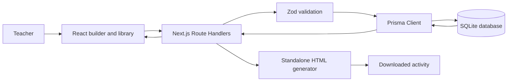
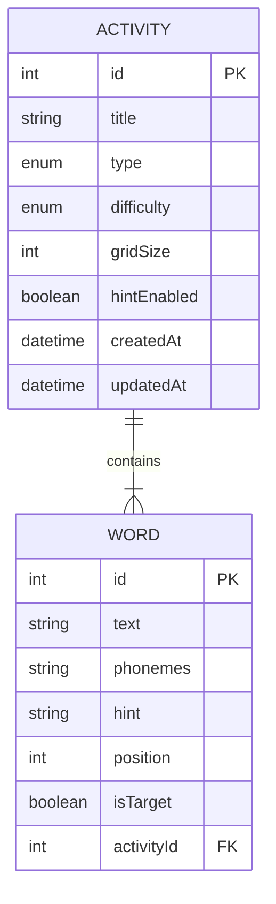

# Architecture and design

## Overview

The Next.js App Router supplies both the React frontend and backend-for-frontend API. Route Handlers validate requests with Zod before Prisma accesses SQLite. The same stored activity supplies the live builder and server-side standalone HTML generator.

## Database schema

`Word.phonemes` contains a JSON-encoded ordered string array. “chip” is stored as `["tʃ", "ɪ", "p"]`. One phoneme can therefore use multiple characters while its order remains explicit.

## Request workflow

1. A teacher enters settings and words alongside the live preview on `/wordle` or `/word-search`, or uses an activity edit route.
2. The client submits JSON to a collection or item API.
3. The Wordle and Word Search builders submit create payloads, while the dedicated edit route submits updates. Zod checks strings, enums, phoneme arrays, target rules, and Word Search minimums.
4. `/api/dictionary` combines the bundled curated dictionary with teacher-added `DictionaryWord` records. The Wordle selector uses the combined list, while `/api/word-suggestions` still supports editable form suggestions without an internet dependency.
5. Saving from either builder writes the current settings to `Activity`; generating HTML performs the same named save first, then downloads from the stored activity endpoint.
5. Prisma persists the activity and nested words.
6. Builders retrieve saved activities using a type filter.
7. A saved download supplies only the activity ID.
8. The server retrieves that record, checks its phonemes, and returns self-contained playable HTML.

## Validation rules

- Titles require 2–120 characters.
- Activities need 1–30 words.
- Written words cannot be blank.
- Words need 1–30 ordered, non-empty phonemes of at most 20 characters each.
- Wordle requires exactly one target.
- Word Search requires at least two words and a grid size from 7–12.
- Type and difficulty use closed enums.
- Malformed JSON, invalid IDs, missing records, and invalid persisted phonemes receive distinct responses.

## Dashboard data flow

`/dashboard` fetches `/api/dashboard` and `/health` independently every 30 seconds. A Prisma transaction collects consistent library counts, difficulty groups, recent configurations, generation outcomes and visit aggregates. Curated and custom dictionary names are deduplicated. Empty metrics remain zero or explicitly unavailable; no simulated usage is added to the operational figures.

`GenerationEvent` stores a nullable activity type, success flag and timestamp for each HTML download endpoint response. Events have no foreign key to an activity, so deleting classroom resources does not erase monitoring history. Metrics writes are best-effort and log a server error on failure without breaking an otherwise valid download.

`PageVisit` stores an anonymous UUID, activity type, cumulative visible duration and creation time. The root layout's tracker runs only on builder routes. The usage endpoint validates its payload and transactionally upserts a visit, then advances its duration only when the new value is greater. Duplicate, reordered, hidden-tab and navigation updates do not double-count elapsed time. Browser-reported measurements are approximate, not authenticated audit records. No student identifiers or game results are collected.

The dashboard labels library totals as current saved records and usage as recorded history. Average page time includes ongoing visits; most-used type means the builder with more recorded page visits. The SQLite migration adds two tables without modifying existing activities, words or dictionary entries.

## Docker runtime

The multi-stage Dockerfile installs locked dependencies, generates Prisma Client, and builds Next.js. Startup applies committed migrations and runs an idempotent seed. `DATABASE_URL=file:/data/activities.db` places SQLite in a named volume. Docker’s health check requests `/health`, which also verifies database access.

## Trade-offs

SQLite keeps the assessment reproducible in one container and suits a small, single-instance tool. It is less suitable for many simultaneous writers or horizontal scaling. JSON-encoded arrays preserve complex phoneme units simply; a larger linguistic platform could normalize phonemes into another ordered relation. Replacing child words during update keeps CRUD understandable, while a collaborative production editor could use granular word endpoints and optimistic concurrency.
