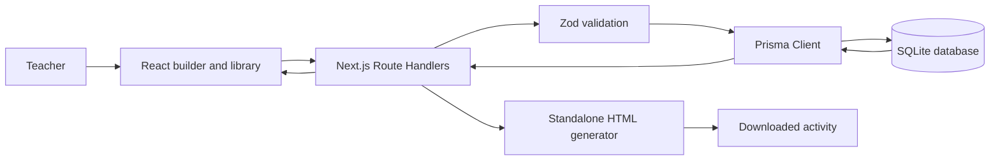
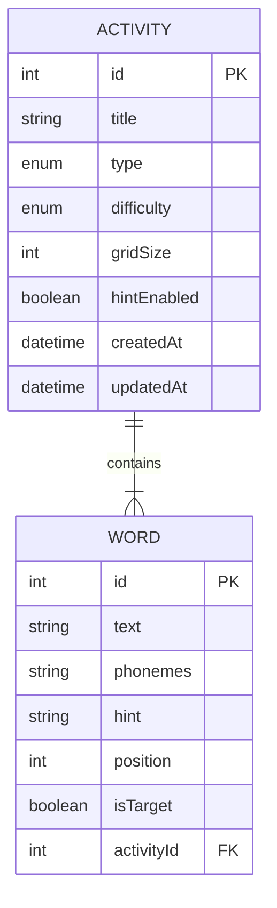

# Architecture and design

## Overview

The Next.js App Router supplies both the React frontend and backend-for-frontend API. Route Handlers validate requests with Zod before Prisma accesses SQLite. The same stored activity supplies the live builder and server-side standalone HTML generator.

## Database schema

`Word.phonemes` contains a JSON-encoded ordered string array. “chip” is stored as `["tʃ", "ɪ", "p"]`. One phoneme can therefore use multiple characters while its order remains explicit.

## Request workflow

1. A teacher enters settings and words on `/activities`.
2. The client submits JSON to a collection or item API.
3. Zod checks strings, enums, phoneme arrays, target rules, and Word Search minimums.
4. Prisma persists the activity and nested words.
5. Builders retrieve saved activities using a type filter.
6. A saved download supplies only the activity ID.
7. The server retrieves that record, checks its phonemes, and returns self-contained playable HTML.

## Validation rules

- Titles require 2–120 characters.
- Activities need 1–30 words.
- Written words cannot be blank.
- Words need 1–30 ordered, non-empty phonemes of at most 20 characters each.
- Wordle requires exactly one target.
- Word Search requires at least two words and a grid size from 7–12.
- Type and difficulty use closed enums.
- Malformed JSON, invalid IDs, missing records, and invalid persisted phonemes receive distinct responses.

## Docker design

The multi-stage Dockerfile installs locked dependencies, generates Prisma Client, and builds Next.js. Startup applies committed migrations and runs an idempotent seed. `DATABASE_URL=file:/data/activities.db` places SQLite in a named volume. Docker’s health check requests `/health`, which also verifies database access.

## Trade-offs

SQLite keeps the assessment reproducible in one container and suits a small, single-instance tool. It is less suitable for many simultaneous writers or horizontal scaling. JSON-encoded arrays preserve complex phoneme units simply; a larger linguistic platform could normalize phonemes into another ordered relation. Replacing child words during update keeps CRUD understandable, while a collaborative production editor could use granular word endpoints and optimistic concurrency.
